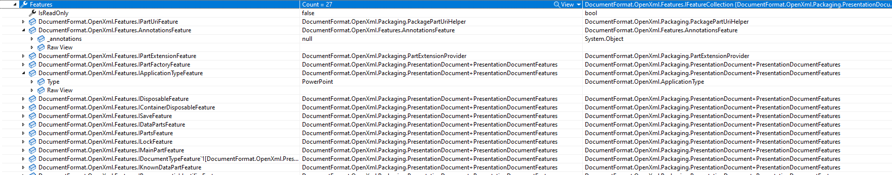

# Custom SDK Features

Features in the Open XML SDK are available starting in v2.14.0 that allows for behavior and state to be contained within the document or part and customized without reimplementing the containing package or part. This is accessed via `Features` property  on packages, parts, and elements.

This is an implementation of the [strategy pattern](https://refactoring.guru/design-patterns/strategy) that makes it easy to replace behavior on the fly. It is modeled after the [request features](/aspnet/core/fundamentals/request-features) in ASP.NET Core.

## Feature inheritance

Packages, parts, and elements all have their own feature collection. However, they will also inherit the containing part and package if it is available.

To highlight this, see the test case below:

```csharp
OpenXmlPackage package = /* Create a package */;

var packageFeature = new PrivateFeature();
package.Features.Set<PrivateFeature>(packageFeature);

var part = package.GetPartById("existingPart");
Assert.Same(part.Features.GetRequired<PrivateFeature>(), package.Features.GetRequired<PrivateFeature>());

part.Features.Set<PrivateFeature>(new());
Assert.NotSame(part.Features.GetRequired<PrivateFeature>(), package.Features.GetRequired<PrivateFeature>());


private sealed class PrivateFeature
{
}
```
> [!NOTE]
> The feature collection on elements is readonly. This is due to memory issues if it is made writeable. If this is needed, please engage on https://github.com/dotnet/open-xml-sdk to let us know your scenario.

## Visualizing Registered Features

The in-box implementations of the `IFeatureCollection` provide a helpful debug view so you can see what features are available and what their properties/fields are:



## Available Features

The features that are currently available are described below and at what scope they are available:

### IDisposableFeature

This feature allows for registering actions that need to run when a package or a part is destroyed or disposed:

```csharp
OpenXmlPackage package = GetSomePackage();
package.Features.Get<IDisposableFeature>().Register(() => /* Some action that is called when the package is disposed */);

OpenXmlPart part = GetSomePart();
part.Features.Get<IDisposableFeature>().Register(() => /* Some action that is called when the part is removed or closed */);
```

Packages and parts will have their own implementations of this feature. Elements will retrieve the feature for their containing part if available.

### IPackageEventsFeature

This feature allows getting event notifications of when a package is changed:

```csharp
OpenXmlPackage package = GetSomePackage();
package.TryAddPackageEventsFeature();

var feature = package.Features.GetRequired<IPackageEventsFeature>();
```

> Note: There may be times when the package is changed but an event is not fired. Not all areas have been identified where it would make sense to raise an event. Please file an issue if you find one.

### IPartEventsFeature

This feature allows getting event notifications of when an event is being created. This is a feature that is added to the part or package:

```csharp
OpenXmlPart part = GetSomePackage();
package.AddPartEventsFeature();

var feature = part.Features.GetRequired<IPartEventsFeature>();
```

Generally, assume that there may be a singleton implementation for the events and verify that the part is the correct part.

> Note: There may be times when the part is changed but an event is not fired. Not all areas have been identified where it would make sense to raise an event. Please file an issue if you find one.

### IPartRootEventsFeature

This feature allows getting event notifications of when a part root is being modified/loaded/created/etc. This is a feature that is added to the part level feature:

```csharp
OpenXmlPart part = GetSomePart();
part.AddPartRootEventsFeature();

var feature = part.Features.GetRequired<IPartRootEventsFeature>();
```

Generally, assume that there may be a singleton implementation for the events and verify that the part is the correct part.

> Note: There may be times when the part root is changed but an event is not fired. Not all areas have been identified where it would make sense to raise an event. Please file an issue if you find one.

### IRandomNumberGeneratorFeature

This feature allows for a shared service to generate random numbers and fill an array.

### IParagraphIdGeneratorFeature

This feature allows for population and tracking of elements that contain paragraph ids. By default, this will ensure uniqueness of values and ensure that values that do exist are valid per the constraints of the standard. To use this feature:

```csharp
WordprocessingDocument document = CreateWordDocument();
document.TryAddParagraphIdFeature();

var part = doc.AddMainDocumentPart();
var body = new Body();
part.Document = new Document(body);

var p = new Paragraph();
body.AddChild(p); // After adding p.ParagraphId will be set to a unique, valid value
```

This feature can also be used to ensure uniqueness among multiple documents with a slight change:

```csharp
using var doc1 = CreateDocument1();
using var doc2 = CreateDocument2();

var shared = doc1
    .AddSharedParagraphIdFeature()
    .Add(doc2);

// Add item to doc1
var part1 = doc1.AddMainDocumentPart();
var body1 = new Body();
var p1 = new Paragraph();
part1.Document = new Document(body1);
body1.AddChild(p1);

// Add item with same ID to doc2
var part2 = doc2.AddMainDocumentPart();
var body2 = new Body();
var p2 = new Paragraph { ParagraphId = p1.ParagraphId };
part2.Document = new Document(body2);
body2.AddChild(p2);

// Assert
Assert.NotEqual(p1.ParagraphId, p2.ParagraphId);
Assert.Equal(2, shared.Count);
```

### IPartRootXElementFeature

This feature allows operating on an `OpenXmlPart` by using XLinq features and directly manipulating `XElement` nodes.

```csharp
OpenXmlPart part = GetSomePart();

var node = new(W.document, new XAttribute(XNamespace.Xmlns + "w", W.w),
    new XElement(W.body,
        new XElement(W.p,
            new XElement(W.r,
                new XElement(W.t, "Hello World!")))));

part.SetXElement(node);
```

This `XElement` is cached but will be kept in sync with the underlying part if it were to change.
