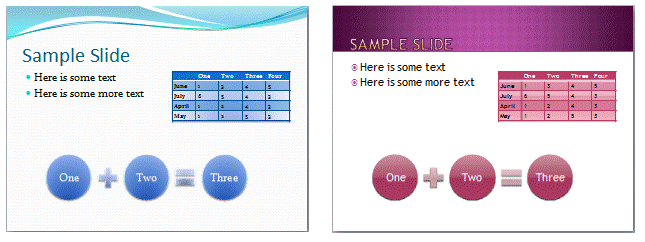

---

api_name:
- Microsoft.Office.DocumentFormat.OpenXML.Packaging
api_type:
- schema
ms.assetid: cfb75725-f3a7-43c0-85f4-7bb4c3f448ca
title: 'How to: Replace the theme part in a word processing document'
ms.suite: office

ms.author: o365devx
author: o365devx
ms.topic: conceptual
ms.date: 01/08/2025
ms.localizationpriority: medium
---
# Replace the theme part in a word processing document

This topic shows how to use the classes in the Open XML SDK for
Office to programmatically replace a document part in a word processing
document.

[!include[Structure](../includes/word/packages-and-document-parts.md)]


## Getting a WordprocessingDocument Object

In the sample code, you start by opening the word processing file by
instantiating the <xref:DocumentFormat.OpenXml.Packaging.WordprocessingDocument> class as shown in
the following `using` statement. In the same
statement, you open the word processing file *document* by using the
<xref:DocumentFormat.OpenXml.Packaging.WordprocessingDocument.Open%2A> method, with the Boolean parameter set
to `true` to enable editing the document.

### [C#](#tab/cs-1)
[!code-csharp[](../../samples/word/replace_the_theme_part/cs/Program.cs#snippet1)]

### [Visual Basic](#tab/vb-1)
[!code-vb[](../../samples/word/replace_the_theme_part/vb/Program.vb#snippet1)]
***

[!include[Using Statement](../includes/word/using-statement.md)]


## How to Change Theme in a Word Package

If you would like to change the theme in a Word document, click the
ribbon **Design** and then click **Themes**. The **Themes** pull-down
menu opens. To choose one of the built-in themes and apply it to the
Word document, click the theme icon. You can also use the option **Browse for Themes...** to locate and apply a theme file
in your computer.


## The Structure of the Theme Element

The theme element is constituted of color, font, and format schemes. In
this how-to you learn how to change the theme programmatically.
Therefore, it is useful to familiarize yourself with the theme element.
The following information from the [!include[ISO/IEC 29500 URL](../includes/iso-iec-29500-link.md)] specification can
be useful when working with this element.

This element defines the root level complex type associated with a
shared style sheet (or theme). This element holds all the different
formatting options available to a document through a theme, and defines
the overall look and feel of the document when themed objects are used
within the document.

[*Example*: Consider the following image as an example of different
themes in use applied to a presentation. In this example, you can see
how a theme can affect font, colors, backgrounds, fills, and effects for
different objects in a presentation. end example]



In this example, we see how a theme can affect font, colors,
backgrounds, fills, and effects for different objects in a presentation.
*end example*]

&copy; [!include[ISO/IEC 29500 version](../includes/iso-iec-29500-version.md)]

The following table lists the possible child types of the Theme class.

| PresentationML Element | Open XML SDK Class | Description |
|---|---|---|
| `<custClrLst/>` | <xref:DocumentFormat.OpenXml.Drawing.CustomColorList> |Custom Color List |
| `<extLst/>` | <xref:DocumentFormat.OpenXml.Presentation.ExtensionList> | Extension List |
| `<extraClrSchemeLst/>` | <xref:DocumentFormat.OpenXml.Drawing.Theme.ExtraColorSchemeList*> | Extra Color Scheme List |
| `<objectDefaults/>` | <xref:DocumentFormat.OpenXml.Drawing.Theme.ObjectDefaults*> | Object Defaults |
| `<themeElements/>` | <xref:DocumentFormat.OpenXml.Drawing.Theme.ThemeElements*> | Theme Elements |

The following XML Schema fragment defines the four parts of the theme
element. The `themeElements` element is the
piece that holds the main formatting defined within the theme. The other
parts provide overrides, defaults, and additions to the information
contained in `themeElements`. The complex
type defining a theme, `CT_OfficeStyleSheet`, is defined in the following
manner:

```xml
    <complexType name="CT_OfficeStyleSheet">
       <sequence>
           <element name="themeElements" type="CT_BaseStyles" minOccurs="1" maxOccurs="1"/>
           <element name="objectDefaults" type="CT_ObjectStyleDefaults" minOccurs="0" maxOccurs="1"/>
           <element name="extraClrSchemeLst" type="CT_ColorSchemeList" minOccurs="0" maxOccurs="1"/>
           <element name="custClrLst" type="CT_CustomColorList" minOccurs="0" maxOccurs="1"/>
           <element name="extLst" type="CT_OfficeArtExtensionList" minOccurs="0" maxOccurs="1"/>
       </sequence>
       <attribute name="name" type="xsd:string" use="optional" default=""/>
    </complexType>
```

This complex type also holds a `CT_OfficeArtExtensionList`, which is used for
future extensibility of this complex type.


## How the Sample Code Works

After opening the file, you can instantiate the `MainDocumentPart` in the `wordDoc` object, and
delete the old theme part.

### [C#](#tab/cs-2)
[!code-csharp[](../../samples/word/replace_the_theme_part/cs/Program.cs#snippet2)]

### [Visual Basic](#tab/vb-2)
[!code-vb[](../../samples/word/replace_the_theme_part/vb/Program.vb#snippet2)]
***

You can then create add a new <xref:DocumentFormat.OpenXml.Packaging.ThemePart>
object and add it to the `MainDocumentPart`
object. Then you add content by using a `StreamReader` and <xref:System.IO.StreamWriter> objects to copy the theme from the
`themeFile` to the <xref:DocumentFormat.OpenXml.Packaging.ThemePart>  object.

### [C#](#tab/cs-3)
[!code-csharp[](../../samples/word/replace_the_theme_part/cs/Program.cs#snippet3)]

### [Visual Basic](#tab/vb-3)
[!code-vb[](../../samples/word/replace_the_theme_part/vb/Program.vb#snippet3)]
***


## Sample Code

The following code example shows how to replace the theme document part
in a word processing document with the theme part from another package.
The theme file passed as the second argument must be a valid theme part
in XML format (for example, Theme1.xml). You can extract this part from
an existing document or theme file (.THMX) that has been renamed to be a
.Zip file. To call the method `ReplaceTheme`
you can use the following call example to copy the theme from the file
from `arg[1]` and to the file located at `arg[0]`

### [C#](#tab/cs-4)
[!code-csharp[](../../samples/word/replace_the_theme_part/cs/Program.cs#snippet4)]

### [Visual Basic](#tab/vb-4)
[!code-vb[](../../samples/word/replace_the_theme_part/vb/Program.vb#snippet4)]
***


After you run the program open the Word file and notice the new theme changes.

Following is the complete sample code in both C\# and Visual Basic.

### [C#](#tab/cs)
[!code-csharp[](../../samples/word/replace_the_theme_part/cs/Program.cs#snippet0)]

### [Visual Basic](#tab/vb)
[!code-vb[](../../samples/word/replace_the_theme_part/vb/Program.vb#snippet0)]
***

## See also


- [Open XML SDK class library reference](/office/open-xml/open-xml-sdk)
