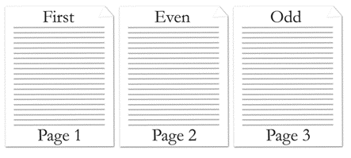

---

api_name:
- Microsoft.Office.DocumentFormat.OpenXML.Packaging
api_type:
- schema
ms.assetid: d57e9b7d-b271-4c8d-998f-b7ca3eb6c850
title: 'How to: Replace the header in a word processing document (Open XML SDK)'
description: 'Learn how to replace the header in a word processing document using the Open XML SDK.'
ms.suite: office

ms.author: o365devx
author: o365devx
ms.topic: conceptual
ms.date: 06/28/2021
ms.localizationpriority: high
---
# Replace the header in a word processing document (Open XML SDK)

This topic shows how to use the classes in the Open XML SDK for
Office to replace the header in word processing document
programmatically.

To use the sample code in this topic, you must install the [Open XML SDK](https://www.nuget.org/packages/DocumentFormat.OpenXml). You
must explicitly reference the following assemblies in your project:

- WindowsBase

- DocumentFormat.OpenXml (installed by the Open XML SDK)

You must also use the following **using**
directives or **Imports** statements to compile
the code in this topic.

```csharp
    using System.Collections.Generic;
    using System.Linq;
    using DocumentFormat.OpenXml.Packaging;
    using DocumentFormat.OpenXml.Wordprocessing;
```

```vb
    Imports System.Collections.Generic
    Imports System.Linq
    Imports DocumentFormat.OpenXml.Packaging
    Imports DocumentFormat.OpenXml.Wordprocessing
```

## Structure of the Header Reference Element

In this example you are going to delete the header part from the target
file and create another header part. You are also going to delete the
reference to the existing header and create a reference to the new
header. Therefore it is useful to familarize yourself with headers and
the header reference element. The following information from the
[ISO/IEC 29500](https://www.iso.org/standard/71691.html)
specification introduces the header reference element.

## headerReference (Header Reference)

This element specifies a single header which shall be associated with
the current section in the document. This header shall be referenced via
the **id** attribute, which specifies an explicit relationship to the
appropriate Header part in the WordprocessingML package.

If the relationship type of the relationship specified by this element
is not `https://schemas.openxmlformats.org/officeDocument/2006/header`,
is not present, or does not have a **TargetMode** attribute value of
**Internal**, then the document shall be
considered non-conformant.

Within each section of a document there may be up to three different
types of headers:

- First page header

- Odd page header

- Even page header

The header type specified by the current **headerReference** is
specified via the **type** attribute.

If any type of header is omitted for a given section, then the following
rules shall apply.

- If no **headerReference** for the first page header is specified and  the **titlePg** element is specified, then the first page header shall be inherited from the previous section or, if this is the first section in the document, a new blank header shall be created. If the **titlePg** element is not specified, then no first page header shall be shown, and the odd page header shall be used in its place.

- If no **headerReference** for the even page header is specified and the **evenAndOddHeaders** element is specified, then the even page header shall be inherited from the previous section or, if this is the first section in the document, a new blank header shall be created. If the **evenAndOddHeaders** element is not specified, then no even page header shall be shown, and the odd page header shall be used in its place.

- If no **headerReference** for the odd page header is specified then the even page header shall be inherited from the previous section or, if this is the first section in the document, a new blank header shall be created.

*Example*: Consider a three page document with different first, odd,
and even page header defined as follows:


  
This document defines three headers, each of which has a relationship
from the document part with a unique relationship ID, as shown in the
following packaging markup:

```xml
    <Relationships xmlns=https://schemas.openxmlformats.org/package/2006/relationships>
      …
      <Relationship Id="rId2" Type="https://schemas.openxmlformats.org/officeDocument/2006/relationships/header" Target="header1.xml" />
      <Relationship Id="rId3" Type="https://schemas.openxmlformats.org/officeDocument/2006/relationships/header" Target="header2.xml" />
      <Relationship Id="rId5" Type="https://schemas.openxmlformats.org/officeDocument/2006/relationships/header" Target="header3.xml" />
      …
    </Relationships>
```

These relationships are then referenced in the section's properties
using the following WordprocessingML:

```xml
    <w:sectPr>  
      …  
      <w:headerReference r:id="rId3" w:type="first" />  
      <w:headerReference r:id="rId5" w:type="default" />  
      <w:headerReference r:id="rId2" w:type="even" />  
      …  
    </w:sectPr>  
```

The resulting section shall use the header part with relationship id
**rId3** for the first page, the header part with
relationship id **rId2** for all subsequent even
pages, and the header part with relationship id **rId5** for all subsequent odd pages. *end example*]

© ISO/IEC29500: 2008.

## Sample Code

The following code example shows how to replace the header in a word
processing document with the header from another word processing
document. To call the method, **AddHeaderFromTo**, you can use the following code
segment as an example.

```csharp
    string filepathFrom = @"C:\Users\Public\Documents\Word15a.docx";
    string filepathTo=@"C:\Users\Public\Documents\Word15b.docx";
    AddHeaderFromTo(filepathFrom, filepathTo);
```

```vb
    Dim filepathFrom As String = "C:\Users\Public\Documents\word15a.docx"
    Dim filepathTo As String = "C:\Users\Public\Documents\Word15b.docx"
    AddHeaderFromTo(filepathFrom, filepathTo)
```

Following is the complete sample code in both C\# and Visual Basic.

### [C#](#tab/cs)
[!code-csharp[](../samples/word/replace_the_header/cs/Program.cs)]

### [Visual Basic](#tab/vb)
[!code-vb[](../samples/word/replace_the_header/vb/Program.vb)]

## See also

- [Open XML SDK class library reference]/office/open-xml/open-xml-sdk)
