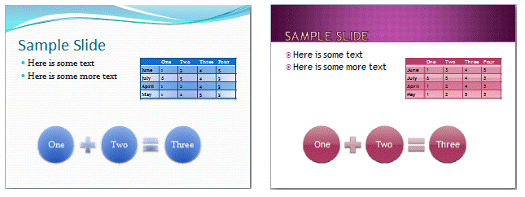

---

api_name:
- Microsoft.Office.DocumentFormat.OpenXML.Packaging
api_type:
- schema
ms.assetid: cfb75725-f3a7-43c0-85f4-7bb4c3f448ca
title: 'How to: Replace the theme part in a word processing document (Open XML SDK)'
ms.suite: office

ms.author: o365devx
author: o365devx
ms.topic: conceptual
ms.date: 11/01/2017
ms.localizationpriority: medium
---
# Replace the theme part in a word processing document (Open XML SDK)

This topic shows how to use the classes in the Open XML SDK for
Office to programmatically replace a document part in a word processing
document.


## Packages and Document Parts

An Open XML document is stored as a package, whose format is defined by
[ISO/IEC 29500-2](https://www.iso.org/standard/71691.html). The
package can have multiple parts with relationships between them. The
relationship between parts controls the category of the document. A
document can be defined as a word-processing document if its
package-relationship item contains a relationship to a main document
part. If its package-relationship item contains a relationship to a
presentation part it can be defined as a presentation document. If its
package-relationship item contains a relationship to a workbook part, it
is defined as a spreadsheet document. In this how-to topic, you will use
a word-processing document package.


## Getting a WordprocessingDocument Object

In the sample code, you start by opening the word processing file by
instantiating the [WordprocessingDocument](https://msdn.microsoft.com/library/office/documentformat.openxml.packaging.wordprocessingdocument.aspx) class as shown in
the following **using** statement. In the same
statement, you open the word processing file *document* by using the
[Open](https://msdn.microsoft.com/library/office/cc562234.aspx) method, with the Boolean parameter set
to **true** to enable editing the document.

```csharp
    using (WordprocessingDocument wordDoc = 
            WordprocessingDocument.Open(document, true))
    {
        // Insert other code here.
    }
```

```vb
    Using wordDoc As WordprocessingDocument = WordprocessingDocument.Open(document, True)
        ' Insert other code here.
    End Using
```

The **using** statement provides a recommended
alternative to the typical .Open, .Save, .Close sequence. It ensures
that the **Dispose** method (internal method
used by the Open XML SDK to clean up resources) is automatically called
when the closing brace is reached. The block that follows the **using** statement establishes a scope for the
object that is created or named in the **using** statement, in this case *wordDoc*. Because
the **WordprocessingDocument** class in the
Open XML SDK automatically saves and closes the object as part of its
**System.IDisposable** implementation, and
because **Dispose** is automatically called
when you exit the block, you do not have to explicitly call **Save** and **Close**─as
long as you use **using**.


## How to Change Theme in a Word Package

If you would like to change the theme in a Word document, click the
ribbon **Page Layout** and then click **Themes**. The **Themes** pull-down
menu opens. To choose one of the built it themes and apply it to the
Word document, click the theme icon. You can also use the option **Browse for Themes...** to locate and apply a theme file
in your computer.


## The Structure of the Theme Element 

The theme element constitutes of color, font, and format schemes. In
this how-to you learn how to change the theme programmatically.
Therefore, it is useful to familiarize yourself with the theme element.
The following information from the [ISO/IEC 29500](https://www.iso.org/standard/71691.html) specification can
be useful when working with this element.

This element defines the root level complex type associated with a
shared style sheet (or theme). This element holds all the different
formatting options available to a document through a theme, and defines
the overall look and feel of the document when themed objects are used
within the document.

[*Example*: Consider the following image as an example of different
themes in use applied to a presentation. In this example, you can see
how a theme can affect font, colors, backgrounds, fills, and effects for
different objects in a presentation. end example]


In this example, we see how a theme can affect font, colors,
backgrounds, fills, and effects for different objects in a presentation.
*end example*]

© ISO/IEC29500: 2008.

The following table lists the possible child types of the Theme class.

| PresentationML Element | Open XML SDK Class | Description |
|---|---|---|
| custClrLst | [CustomColorList](https://msdn.microsoft.com/library/office/documentformat.openxml.drawing.customcolorlist.aspx) |Custom Color List |
| extLst | [ExtensionList](https://msdn.microsoft.com/library/office/documentformat.openxml.presentation.extensionlist.aspx) | Extension List |
| extraClrSchemeLst | [ExtraColorSchemeList](https://msdn.microsoft.com/library/office/documentformat.openxml.drawing.theme.extracolorschemelist.aspx) | Extra Color Scheme List |
| objectDefaults | [ObjectDefaults](https://msdn.microsoft.com/library/office/documentformat.openxml.drawing.theme.objectdefaults.aspx) | Object Defaults |
| themeElements | [ThemeElements](https://msdn.microsoft.com/library/office/documentformat.openxml.drawing.theme.themeelements.aspx) | Theme Elements |

The following XML Schema fragment defines the four parts of the theme
element. The **themeElements** element is the
piece that holds the main formatting defined within the theme. The other
parts provide overrides, defaults, and additions to the information
contained in **themeElements**. The complex
type defining a theme, **CT\_OfficeStyleSheet**, is defined in the following
manner:

```xml
    <complexType name="CT_OfficeStyleSheet">
       <sequence>
           <element name="themeElements" type="CT_BaseStyles" minOccurs="1" maxOccurs="1"/>
           <element name="objectDefaults" type="CT_ObjectStyleDefaults" minOccurs="0" maxOccurs="1"/>
           <element name="extraClrSchemeLst" type="CT_ColorSchemeList" minOccurs="0" maxOccurs="1"/>
           <element name="custClrLst" type="CT_CustomColorList" minOccurs="0" maxOccurs="1"/>
           <element name="extLst" type="CT_OfficeArtExtensionList" minOccurs="0" maxOccurs="1"/>
       </sequence>
       <attribute name="name" type="xsd:string" use="optional" default=""/>
    </complexType>
```

This complex type also holds a **CT\_OfficeArtExtensionList**, which is used for
future extensibility of this complex type.


## How the Sample Code Works

After opening the file, you can instantiate the **MainDocumentPart** in the *wordDoc* object, and
delete the old theme part.

```csharp
    public static void ReplaceTheme(string document, string themeFile)
    {
        using (WordprocessingDocument wordDoc =
            WordprocessingDocument.Open(document, true))
        {
            MainDocumentPart mainPart = wordDoc.MainDocumentPart;

            // Delete the old document part.
            mainPart.DeletePart(mainPart.ThemePart);
```

```vb
    Public Shared Sub ReplaceTheme(ByVal document As String, ByVal themeFile As String)
        Using wordDoc As WordprocessingDocument = WordprocessingDocument.Open(document, True)
            Dim mainPart As MainDocumentPart = wordDoc.MainDocumentPart

            ' Delete the old document part.
            mainPart.DeletePart(mainPart.ThemePart)
```
You can then create add a new **ThemePart**
object and add it to the **MainDocumentPart**
object. Then you add content by using a **StreamReader** and **StreamWriter** objects to copy the theme from the
*themeFile* to the **ThemePart** object.

```csharp
    // Add a new document part and then add content.
    ThemePart themePart = mainPart.AddNewPart<ThemePart>();

    using (StreamReader streamReader = new StreamReader(themeFile))
    using (StreamWriter streamWriter =
        new StreamWriter(themePart.GetStream(FileMode.Create)))
    {
        streamWriter.Write(streamReader.ReadToEnd());
    }
```

```vb
    ' Add a new document part and then add content.
    Dim themePart As ThemePart = mainPart.AddNewPart(Of ThemePart)()

    Using streamReader As New StreamReader(themeFile)
    Using streamWriter As New StreamWriter(themePart.GetStream(FileMode.Create))
        streamWriter.Write(streamReader.ReadToEnd())
    End Using
    End Using
```

## Sample Code

The following code example shows how to replace the theme document part
in a word processing document with the theme part from another package.
The theme file passed as the second argument must be a valid theme part
in XML format (for example, Theme1.xml). You can extract this part from
an existing document or theme file (.THMX) that has been renamed to be a
.Zip file. To call the method **ReplaceTheme**
you can use the following call example to copy the theme from the file
"Theme1.xml" to the file "MyPkg7.docx."

```csharp
    string document = @"C:\Users\Public\Documents\\MyPkg7.docx";
    string themeFile = @"C:\Users\Public\Documents\Theme1.xml";
    ReplaceTheme(document, themeFile);
```

```vb
    Dim document As String = "C:\Users\Public\Documents\\MyPkg7.docx"
    Dim themeFile As String = "C:\Users\Public\Documents\Theme1.xml"
    ReplaceTheme(document, themeFile)
```

After you run the program open the Word file and notice the change in
font.

Following is the complete sample code in both C\# and Visual Basic.

### [C#](#tab/cs)
[!code-csharp[](../samples/word/replace_the_theme_part/cs/Program.cs)]

### [Visual Basic](#tab/vb)
[!code-vb[](../samples/word/replace_the_theme_part/vb/Program.vb)]

## See also


- [Open XML SDK class library reference](/office/open-xml/open-xml-sdk)
