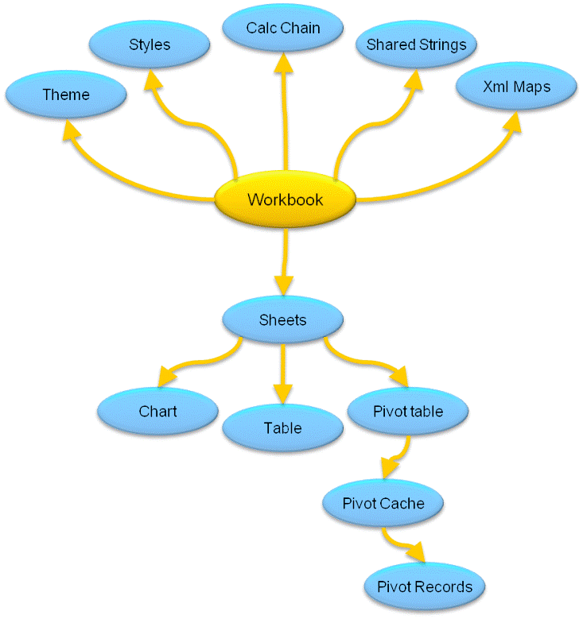

---

api_name:
- Microsoft.Office.DocumentFormat.OpenXML.Packaging
api_type:
- schema
ms.assetid: 3b35a153-c8ff-4dc7-96d5-02c515f31770
title: Structure of a SpreadsheetML document
ms.suite: office

ms.author: o365devx
author: o365devx
ms.topic: conceptual
ms.date: 11/01/2017
ms.localizationpriority: high
---
# Structure of a SpreadsheetML document

The document structure of a **SpreadsheetML**
document consists of the \<**workbook**\>
element that contains \<**sheets**\> and
\<**sheet**\> elements that reference the
worksheets in the workbook. A separate XML file is created for each
worksheet. These elements are the minimum elements required for a valid
spreadsheet document. In addition, a spreadsheet document might contain
\<**table**\>, \<**chartsheet**\>, \<**pivotTableDefinition**\>, or other spreadsheet
related elements.

[!include[Add-ins note](../includes/addinsnote.md)]

--------------------------------------------------------------------------------
## Important Spreadsheet Parts

Using the Open XML SDK for Office, you can create document structure
and content that uses strongly-typed classes that correspond to **SpreadsheetML** elements. You can find these
classes in the **DocumentFormat.OpenXML.Spreadsheet** namespace. The
following table lists the class names of the classes that correspond to
some of the important spreadsheet elements.


| Package Part| Top Level SpreadsheetML Element | Open XML SDK Class | Description|
|:------------|:--------------------------------|:-----------------------|:-----------|
| Workbook  |   workbook  |  [Workbook](https://msdn.microsoft.com/library/office/documentformat.openxml.spreadsheet.workbook.aspx)   |   The root element for the main document part.|  
| Worksheet  |  worksheet     |    [Worksheet](https://msdn.microsoft.com/library/office/documentformat.openxml.spreadsheet.worksheet.aspx) | A type of sheet that represent a grid of cells that contains text, numbers, dates or formulas. For more information, see [Working with sheets](working-with-sheets.md).  |
|Chart Sheet |  chartsheet  | [Chartsheet](https://msdn.microsoft.com/library/office/documentformat.openxml.spreadsheet.chartsheet.aspx) | A sheet that represents a chart that is stored as its own sheet. For more information, see [Working with sheets](working-with-sheets.md).  | 
| Table    |    table    |     [Table](https://msdn.microsoft.com/library/office/documentformat.openxml.spreadsheet.table.aspx)  | A logical construct that specifies that a range of data belongs to a single dataset. For more information, see [Working with SpreadsheetML tables](overview.md).  | 
|Pivot Table       | [pivotTableDefinition](https://msdn.microsoft.com/library/office/documentformat.openxml.spreadsheet.pivottabledefinition.aspx) |  [PivotTableDefinition](https://msdn.microsoft.com/library/office/documentformat.openxml.spreadsheet.pivottabledefinition.aspx)  |  A logical construct that displays aggregated view of data in an understandable layout. For more information, see [Working with PivotTables](working-with-pivottables.md).  | 
|Pivot Cache  |   pivotCacheDefinition  | [PivotCacheDefinition](https://msdn.microsoft.com/library/office/documentformat.openxml.spreadsheet.pivotcachedefinition.aspx) |  A construct that defines the source of the data in the PivotTable. For more information, see [Working with PivotTables](working-with-pivottables.md).  | 
|Pivot Cache Records |  pivotCacheRecords  |  [PivotCacheRecords](https://msdn.microsoft.com/library/office/documentformat.openxml.spreadsheet.pivotcacherecords.aspx)  |  A cache of the source data of the PivotTable. For more information, see [Working with PivotTables](working-with-pivottables.md). | 
| Calculation Chain | calcChain  |  [CalculationChain](https://msdn.microsoft.com/library/office/documentformat.openxml.spreadsheet.calculationchain.aspx) | A construct that specifies the order in which cells in the workbook were last calculated. For more information, see [Working with the calculation chain](working-with-the-calculation-chain.md).  | 
|Shared String Table |  sst  |  [SharedStringTable](https://msdn.microsoft.com/library/office/documentformat.openxml.spreadsheet.sharedstringtable.aspx)     | A construct that contains one occurrence of each unique string that occurs on all worksheets in a workbook. For more information, see [Working with the shared string table](working-with-the-shared-string-table.md). |
|Conditional Formatting |   conditionalFormatting   | [ConditionalFormatting](https://msdn.microsoft.com/library/office/documentformat.openxml.spreadsheet.conditionalformatting.aspx)  |  A construct that defines a format applied to a cell or series of cells. For more information, see [Working with conditional formatting](working-with-conditional-formatting.md).   | 
| Formulas  |      f    |  [CellFormula](https://msdn.microsoft.com/library/office/documentformat.openxml.spreadsheet.cellformula.aspx)  |  A construct that defines the formula text for a cell that contains a formula. For more information, see [Working with formulas](working-with-formulas.md).  | 

--------------------------------------------------------------------------------
## Minimum Workbook Scenario

The following text from the [Standard ECMA-376](https://www.ecma-international.org/publications-and-standards/standards/ecma-376/)
introduces the minimum workbook scenario.

The smallest possible (blank) workbook must contain the following:

A single sheet  

A sheet ID  

A relationship Id that points to the location of the sheet definition  

© Ecma International: December 2006.  

### Open XML SDK Code Example

This code example uses the classes in the Open XML SDK to create a
minimum, blank workbook.

### [CSharp](#tab/cs)
[!code-csharp[](../../samples/spreadsheet/structure_ofml/cs/Program.cs)]

### [Visual Basic](#tab/vb)
[!code-vb[](../../samples/spreadsheet/structure_ofml/vb/Program.vb)]

### Generated SpreadsheetML

After you run the Open XML SDK code to generate a minimum workbook,
you can explore the contents of the .zip package to view the
SpreadsheetML XML code. To view the .zip package, rename the extension
on the minimum spreadsheet from **.xlsx** to
**.zip**. Inside the .zip package, there are
several parts that make up the minimum workbook.

The following figure shows the structure under the **xl** folder of the .zip package for a minimum
workbook.

Figure 1. .zip folder structure

  
   
The **workbook.xml** file contains \<**sheet**\> elements that reference the worksheets in
the workbook. Each worksheet is associated to the workbook via a Sheet
ID and a relationship ID. The **sheetID** is
the ID used within the package to identify a sheet and must be unique
within the workbook. The **id** is the
relationship ID that identifies the sheet part definition associated
with a sheet.

The following XML code is the spreadsheetML that represents the workbook
part of the spreadsheet document. This code is generated when you run
the Open XML SDK code to create a minimum workbook.

```xml
    <?xml version="1.0" encoding="utf-8"?>
    <x:workbook xmlns:x="https://schemas.openxmlformats.org/spreadsheetml/2006/main">
        <x:sheets>
            <x:sheet name="mySheet" sheetId="1" r:id="Rddc7711f116045e5" xmlns:r="https://schemas.openxmlformats.org/officeDocument/2006/relationships" />
        </x:sheets>
    </x:workbook>
```

The **workbook.xml.rels** file contains the
\<**Relationship**\> elements that define the
relationships between the workbook and the worksheets it contains.

The following XML code is the spreadsheetML that represents the
relationship part of the spreadsheet document. This code is generated
when you run the Open XML SDK to create a minimum workbook.

```xml
    <?xml version="1.0" encoding="utf-8"?>
    <Relationships xmlns="https://schemas.openxmlformats.org/package/2006/relationships">
        <Relationship Type="https://schemas.openxmlformats.org/officeDocument/2006/relationships/worksheet" Target="/xl/worksheets/sheet.xml" Id="Rddc7711f116045e5" />
    </Relationships>
```

The **sheet.xml** file contains the \<**sheetData**\> element that represents the cell
table. In this example, the workbook is blank, so the \<**sheetData**\> element is empty. For more
information about sheets, see [Working with sheets](working-with-sheets.md)**.

The following XML code is the spreadsheetML that represents the
worksheet part of the spreadsheet document. This code is generated when
you run the Open XML SDK to create a minimum workbook.

```xml
    <?xml version="1.0" encoding="utf-8"?>
    <x:worksheet xmlns:x="https://schemas.openxmlformats.org/spreadsheetml/2006/main">
        <x:sheetData />
    </x:worksheet>
```

--------------------------------------------------------------------------------
## Typical Workbook Scenario
A typical workbook will not be a blank, minimum workbook. A typical
workbook might contain numbers, text, charts, tables, and pivot tables.
Each of these additional parts is contained within the .zip package of
the spreadsheet document.

The following figure shows most of the elements that you would find in a
typical spreadsheet.

Figure 2. Typical spreadsheet elements

  
 
