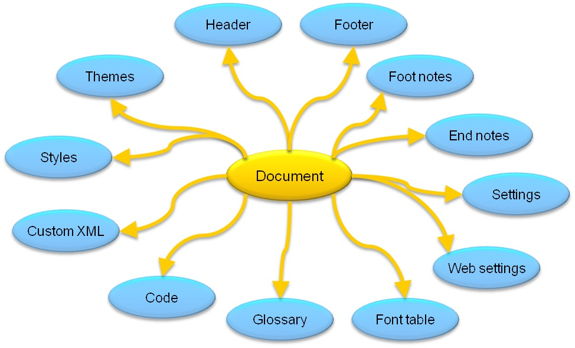

# Structure of a WordprocessingML document (Open XML SDK)

This topic discusses the basic structure of a <span
class="keyword">WordprocessingML</span> document and reviews important
Open XML SDK classes that are used most often to create <span
class="keyword">WordprocessingML</span> documents.

The basic document structure of a <span
class="keyword">WordProcessingML</span> document consists of the \<<span
class="keyword">document</span>\> and \<<span
class="keyword">body</span>\> elements, followed by one or more block
level elements such as \<**p**\>, which
represents a paragraph. A paragraph contains one or more \<<span
class="keyword">r</span>\> elements. The \<<span
class="keyword">r</span>\> stands for run, which is a region of text
with a common set of properties, such as formatting. A run contains one
or more \<**t**\> elements. The \<<span
class="keyword">t</span>\> element contains a range of text.

**In This Section**

[Important WordprocessingML Parts](structure-of-a-wordprocessingml-document.md#ImpWPParts)

[Minimum Document Scenario](structure-of-a-wordprocessingml-document.md#MinDocScen)

[Typical Document Scenario](structure-of-a-wordprocessingml-document.md#TypDocScen)


## Important WordprocessingML Parts

The Open XML SDK 2.5 API provides strongly-typed classes in the
DocumentFormat.OpenXML.WordprocessingML namespace that correspond to
**WordprocessingML** elements.

The following table lists some important <span
class="keyword">WordprocessingML</span> elements, the <span
class="keyword">WordprocessingML</span> document package part that the
element corresponds to (where applicable) and the managed class that
represents the element in the Open XML SDK 2.5 API.

| **Package Part** | **WordprocessingML Element** | **Open XML SDK 2.5 Class** | **Description** |
|---|---|---|---|
| Main Document|document | [Document](https://msdn.microsoft.com/library/office/documentformat.openxml.wordprocessing.document.aspx) | The root element for the main document part. |
| Comments | comments | [Comments](https://msdn.microsoft.com/library/office/documentformat.openxml.wordprocessing.comments.aspx) | The root element for the comments part. |
| Document Settings | settings | [Settings](https://msdn.microsoft.com/library/office/documentformat.openxml.wordprocessing.settings.aspx) | The root element for the document settings part. |
| Endnotes | endnotes | [Endnotes](https://msdn.microsoft.com/library/office/documentformat.openxml.wordprocessing.endnotes.aspx) | The root element for the endnotes part. |
| Footer | ftr | [Footer](https://msdn.microsoft.com/library/office/documentformat.openxml.wordprocessing.footer.aspx) | The root element for the footer part. |
| Footnotes | footnotes | [Footnotes](https://msdn.microsoft.com/library/office/documentformat.openxml.wordprocessing.footnotes.aspx) | The root element for the footnotes part. |
| Glossary Document | glossaryDocument | [GlossaryDocument](https://msdn.microsoft.com/library/office/documentformat.openxml.wordprocessing.glossarydocument.aspx) | The root element for the glossary document part. |
| Header | hdr | [Header](https://msdn.microsoft.com/library/office/documentformat.openxml.wordprocessing.header.aspx) | The root element for the header part. |
| Style Definitions | styles | [Styles](https://msdn.microsoft.com/library/office/documentformat.openxml.wordprocessing.styles.aspx) | The root element for a Style Definitions part. |


## Minimum Document Scenario

A **WordprocessingML** document is organized
around the concept of stories. A story is a region of content in a <span
class="keyword">WordprocessingML</span> document. <span
class="keyword">WordprocessingML</span> stories include:

-   comment

-   endnote

-   footer

-   footnote

-   frame, glossary document

-   header

-   main story

-   subdocument

-   text box

Not all stories must be present in a valid <span
class="keyword">WordprocessingML</span> document. The simplest, valid
**WordprocessingML** document only requires a
single story—the main document story. In <span
class="keyword">WordprocessingML</span>, the main document story is
represented by the main document part. At a minimum, to create a valid
**WordprocessingML** document using code, add a
main document part to the document.

The following information from the [ISO/IEC 29500](http://www.iso.org/iso/iso_catalogue/catalogue_tc/catalogue_detail.htm?csnumber=51463)
introduces the WordprocessingML elements required in the main document
part in order to complete the minimum document scenario.

The main document story of the simplest WordprocessingML document
consists of the following XML elements:

document — The root element for a WordprocessingML's main document part,
which defines the main document story.

body — The container for the collection of block-level structures that
comprise the main story.

p — A paragraph.

r — A run.

t — A range of text.

© ISO/IEC29500: 2008.

### Open XML SDK Code Example

The following code uses the Open XML SDK 2.5 to create a simple <span
class="keyword">WordprocessingML</span> document that contains the text
"Hello, Word!"

```csharp
    public static void CreateWordDoc(string filepath, string msg)
    {
        using (WordprocessingDocument doc = WordprocessingDocument.Create(filepath, DocumentFormat.OpenXml.WordprocessingDocumentType.Document))
        {
            // Add a main document part. 
            MainDocumentPart mainPart = doc.AddMainDocumentPart();

            // Create the document structure and add some text.
            mainPart.Document = new Document();
            Body body = mainPart.Document.AppendChild(new Body());
            Paragraph para = body.AppendChild(new Paragraph());
            Run run = para.AppendChild(new Run());

            // String msg contains the text, "Hello, Word!"
            run.AppendChild(new Text(msg));
        }
    }
```

```vb
    Public Shared Sub CreateWordDoc(filepath As String, msg As String)
        Using doc As WordprocessingDocument = WordprocessingDocument.Create(filepath, DocumentFormat.OpenXml.WordprocessingDocumentType.Document)
            ' Add a main document part. 
            Dim mainPart As MainDocumentPart = doc.AddMainDocumentPart()

            ' Create the document structure and add some text.
            mainPart.Document = New Document()
            Dim body As Body = mainPart.Document.AppendChild(New Body())
            Dim para As Paragraph = body.AppendChild(New Paragraph())
            Dim run As Run = para.AppendChild(New Run())

            ' String msg contains the text, "Hello, Word!"
            run.AppendChild(New Text(msg))
        End Using
    End Sub
```

### Generated WordprocessingML

After you run the Open XML SDK 2.5 code in the previous section to
generate a document, you can explore the contents of the .zip package to
view the **WordprocessingML** XML code. To view
the .zip package, rename the extension on the minimum document from
.docx to .zip. The .zip package contains the parts that make up the
document. In this case, since the code created a minimal <span
class="keyword">WordprocessingML</span> document, there is only a single
part—the main document part.The following figure shows the structure
under the word folder of the .zip package for a minimum document that
contains a single line of text.<span class="placeholder">Art
placeholder</span>The document.xml file corresponds to the <span
class="keyword">WordprocessingML</span> main document part and it is
this part that contains the content of the main body of the document.
The following XML code is generated in the document.xml file when you
run the Open XML SDK 2.5 code in the previous section.

```xml
    <?xml version="1.0" encoding="utf-8"?>
    <w:document xmlns:w="http://schemas.openxmlformats.org/wordprocessingml/2006/main">
      <w:body>
        <w:p>
          <w:r>
            <w:t>Hello, Word!</w:t>
          </w:r>
        </w:p>
      </w:body>
    </w:document
```

## Typical Document Scenario

A typical document will not be a blank, minimum document. A typical
document might contain comments, headers, footers, footnotes, and
endnotes, for example. Each of these additional parts is contained
within the zip package of the wordprocessing document.

The following figure shows many of the parts that you would find in a
typical document.

Figure 1. Typical document structure

  
 
