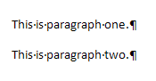
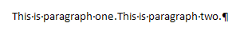

---
api_name:
- Microsoft.Office.DocumentFormat.OpenXML.Packaging
api_type:
- schema
ms.assetid: b3406fcc-f10b-4075-a18f-116400f35faf
title: 'How to: Accept all revisions in a word processing document'
description: 'Learn how to accept all revisions in a word processing document using the Open XML SDK.'
ms.suite: office
ms.author: o365devx
author: o365devx
ms.topic: conceptual
ms.date: 09/12/2024
ms.localizationpriority: high
---

# Accept all revisions in a word processing document

This topic shows how to use the Open XML SDK for Office to accept all revisions in a word processing document programmatically.

[!include[Structure](../includes/word/structure.md)]

The basic document structure of a `WordProcessingML` document consists of the `document` and `body` elements, followed by one or more block level elements such as `p`, which represents a paragraph. A paragraph contains one or more `r` elements. The `r` stands for run, which is a region of text with a common set of properties, such as formatting. A run contains one or more `t` elements. The `t` element contains a range of text. The following code example shows the `WordprocessingML` markup for a document that contains the text "Example text."

```xml
    <w:document xmlns:w="http://schemas.openxmlformats.org/wordprocessingml/2006/main">
      <w:body>
        <w:p>
          <w:r>
            <w:t>Example text.</w:t>
          </w:r>
        </w:p>
      </w:body>
    </w:document>
```

Using the Open XML SDK, you can create document structure and content using strongly-typed classes that correspond to `WordprocessingML` elements. You will find these classes in the <xref:DocumentFormat.OpenXml.Wordprocessing?displayProperty=fullName> namespace. The following table lists the class names of the classes that correspond to the `document`, `body`, `p`, `r`, and `t` elements.

| WordprocessingML Element | Open XML SDK Class | Description |
|---|---|---|
| document | <xref:DocumentFormat.OpenXml.Wordprocessing.Document> | The root element for the main document part. |
| body | <xref:DocumentFormat.OpenXml.Wordprocessing.Body> | The container for the block level structures such as paragraphs, tables, annotations and others specified in the [!include[ISO/IEC 29500 URL](../includes/iso-iec-29500-link.md)] specification. |
| p | <xref:DocumentFormat.OpenXml.Wordprocessing.Paragraph> | A paragraph. |
| r | <xref:DocumentFormat.OpenXml.Wordprocessing.Run> | A run. |
| t | <xref:DocumentFormat.OpenXml.Wordprocessing.Text> | A range of text. |

## ParagraphPropertiesChange Element

When you accept a revision mark, you change the properties of a paragraph either by deleting an existing text or inserting a new text. In the following sections, you read about three elements that are used in the code to change the paragraph contents, mainly, `<w: pPrChange>` (Revision Information for Paragraph Properties), `<w:del>` (Deleted Paragraph), and `<w:ins>` (Inserted Table Row) elements.

The following information from the [!include[ISO/IEC 29500 URL](../includes/iso-iec-29500-link.md)] specification introduces the `ParagraphPropertiesChange` element (`pPrChange`).

### *pPrChange (Revision Information for Paragraph Properties)

This element specifies the details about a single revision to a set of paragraph properties in a WordprocessingML document.

This element stores this revision as follows:

- The child element of this element contains the complete set of paragraph properties which were applied to this paragraph before this revision.

- The attributes of this element contain information about when this revision took place (in other words, when these properties became a "former" set of paragraph properties).

Consider a paragraph in a WordprocessingML document which is centered, and this change in the paragraph properties is tracked as a revision. This revision would be specified using the following WordprocessingML markup.

```xml
    <w:pPr>
      <w:jc w:val="center"/>
      <w:pPrChange w:id="0" w:date="01-01-2006T12:00:00" w:author="Samantha Smith">
        <w:pPr/>
      </w:pPrChange>
    </w:pPr>
```

The element specifies that there was a revision to the paragraph properties at 01-01-2006 by Samantha Smith, and the previous set of paragraph properties on the paragraph was the null set (in other words, no paragraph properties explicitly present under the element). `pPr` `pPrChange`

© [!include[ISO/IEC 29500 version](../includes/iso-iec-29500-version.md)]

## Deleted Element

The following information from the [!include[ISO/IEC 29500 URL](../includes/iso-iec-29500-link.md)] specification
introduces the Deleted element (`del`).

### del (Deleted Paragraph)

This element specifies that the paragraph mark delimiting the end of a paragraph within a WordprocessingML document shall be treated as deleted (in other words, the contents of this paragraph are no longer delimited by this paragraph mark, and are combined with the following paragraph, but those contents shall not automatically be marked as deleted) as part of a tracked revision.

Consider a document consisting of two paragraphs (with each paragraph delimited by a pilcrow ¶):

 If the physical character delimiting the end of the first paragraph is deleted and this change is tracked as a revision, the following will result:


This revision is represented using the following WordprocessingML:

```xml
    <w:p>
      <w:pPr>
        <w:rPr>
          <w:del w:id="0" … />
        </w:rPr>
      </w:pPr>
      <w:r>
        <w:t>This is paragraph one.</w:t>
      </w:r>
    </w:p>
    <w:p>
      <w:r>
        <w:t>This is paragraph two.</w:t>
      </w:r>
    </w:p>
```

The `del` element on the run properties for
the first paragraph mark specifies that this paragraph mark was deleted,
and this deletion was tracked as a revision.

© [!include[ISO/IEC 29500 version](../includes/iso-iec-29500-version.md)]

## The Inserted Element

The following information from the [!include[ISO/IEC 29500 URL](../includes/iso-iec-29500-link.md)] specification
introduces the Inserted element (`ins`).

### ins (Inserted Table Row)

This element specifies that the parent table row shall be treated as an
inserted row whose insertion has been tracked as a revision. This
setting shall not imply any revision state about the table cells in this
row or their contents (which must be revision marked independently), and
shall only affect the table row itself.

Consider a two row by two column table in which the second row has been
marked as inserted using a revision. This requirement would be specified
using the following WordprocessingML:

```xml
    <w:tbl>
      <w:tr>
        <w:tc>
          <w:p/>
        </w:tc>
        <w:tc>
          <w:p/>
        </w:tc>
      </w:tr>
      <w:tr>
        <w:trPr>
          <w:ins w:id="0" … />
        </w:trPr>
        <w:tc>
          <w:p/>
        </w:tc>
        <w:tc>
          <w:p/>
        </w:tc>
      </w:tr>
    </w:tbl>
```

The `ins` element on the table row properties for the second table row
specifies that this row was inserted, and this insertion was tracked as
a revision.

© [!include[ISO/IEC 29500 version](../includes/iso-iec-29500-version.md)]

## Move From Element

The following information from the [!include[ISO/IEC 29500 URL](../includes/iso-iec-29500-link.md)] specification
introduces the Move From element (`moveFrom`).

### moveFrom (Move Source Paragraph)

This element indicates that the parent paragraph has been relocated
from this position and marked as a revision. This does not affect the revision
status of the paragraph's content and pertains solely to the paragraph's
existence as a distinct entity.

Consider a WordprocessingML document where a paragraph of text is moved down
within the document.This relocated paragraph would be represented using the 
following WordprocessingML markup:

```xml
<w:moveFromRangeStart w:id="0" w:name="aMove"/>  
<w:p>  
  <w:pPr>  
    <w:rPr>  
      <w:moveFrom w:id="1" … />  
    </w:rPr>  
  </w:pPr>  
  …</w:p>  
</w:moveFromRangeEnd w:id="0"/>
```

### moveFromRangeStart (Move Source Location Container - Start)

This element marks the beginning of a region where the move source contents are part of a single named move.
The following information from the [!include[ISO/IEC 29500 URL](../includes/iso-iec-29500-link.md)] specification
introduces the Move From Range Star element (`moveFromRangeStart`).

### moveFromRangeEnd (Move Source Location Container - End)

This element marks the end of a region where the move source contents are part of a single named move. 
The following information from the [!include[ISO/IEC 29500 URL](../includes/iso-iec-29500-link.md)] specification
introduces the Move From Range Star element (`moveFromRangeEnd`).

## The Moved To Element
The following information from the [!include[ISO/IEC 29500 URL](../includes/iso-iec-29500-link.md)] specification
introduces the MoveTo element (`moveTo`).

### moveTo (Move Destination Paragraph)
This element specifies that the parent paragraph has been moved to this location and tracked as a revision.
This does not imply anything about the revision state of the contents of the paragraph, and applies only to the existence of the paragraph as its own unique paragraph.

Consider a WordprocessingML document in which a paragraph of text is moved down in the document.
This moved paragraph would be represented using the following WordprocessingML markup:

```xml
<w:moveToRangeStart w:id="0" w:name="aMove"/>  
<w:p>  
  <w:pPr>  
    <w:rPr>  
      <w:moveTo w:id="1" … />  
    </w:rPr>  
  </w:pPr>  
  …</w:p>  
</w:moveToRangeEnd w:id="0"/>
```

### moveToRangeStart (Move Destination Location Container - Start)

This element specifies the start of the region whose move destination contents are part of a single named move. 
The following information from the [!include[ISO/IEC 29500 URL](../includes/iso-iec-29500-link.md)] specification
introduces the Move To Range Start element (`moveToRangeStart`).

### moveToRangeEnd (Move Destination Location Container - End)

This element specifies the end of a region whose move destination contents are part of a single named move. 
The following information from the [!include[ISO/IEC 29500 URL](../includes/iso-iec-29500-link.md)] specification
introduces the Move To Range Start element (`moveToRangeEnd`).

## Sample Code

The following code example shows how to accept the entire revisions in a
word processing document.

After you have run the program, open the word processing file to make
sure that all revision marks have been accepted.

### [C#](#tab/cs)
[!code-csharp[](../../samples/word/accept_all_revisions/cs/Program.cs)]

### [Visual Basic](#tab/vb)
[!code-vb[](../../samples/word/accept_all_revisions/vb/Program.vb)]

## See also

- [Open XML SDK class library reference](/office/open-xml/open-xml-sdk)
