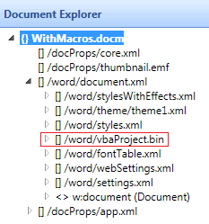

---

api_name:
- Microsoft.Office.DocumentFormat.OpenXML.Packaging
api_type:
- schema
ms.assetid: 80cdc1e8-d023-4886-b8d6-ee26327df739
title: 'How to: Convert a word processing document from the DOCM to the DOCX file format'
description: 'Learn how to convert a word processing document from the DOCM to the DOCX file format using the Open XML SDK.'

ms.suite: office

ms.author: o365devx
author: o365devx
ms.topic: conceptual
ms.date: 05/13/2024
ms.localizationpriority: high
---

# Convert a word processing document from the DOCM to the DOCX file format

This topic shows how to use the classes in the Open XML SDK for
Office to programmatically convert a Microsoft Word document that contains VBA code (and has a .docm extension) to
a standard document (with a .docx extension). It contains an example
`ConvertDOCMtoDOCX` method to illustrate this task.

## ConvertDOCMtoDOCX Method

The `ConvertDOCMtoDOCX` sample method can be used to convert a Word document that contains VBA code (and has a .docm
extension) to a standard document (with a .docx extension). Use this
method to remove the macros and the vbaProject part that contains them
from a document stored in .docm file format. The method accepts a single
parameter that indicates the file name of the file to convert.

### [C#](#tab/cs-0)
[!code-csharp]
### [Visual Basic](#tab/vb-0)
[!code-vb]
***

The complete code listing for the method can be found in the [Sample Code](#sample-code) section.

## Calling the Sample Method

To call the sample method, pass a string that contains the name of the
file to convert. The following sample code shows an example.

### [C#](#tab/cs-1)
[!code-csharp]
### [Visual Basic](#tab/vb-1)
[!code-vb]
***

## Parts and the vbaProject Part

A word processing document package such as a file that has a .docx or
.docm extension is in fact a .zip file that consists of several **parts**. You can think of each part as being similar
to an external file. A part has a particular content type, and can
contain content equivalent to an external XML file, binary file, image
file, and so on, depending on the type. The standard that defines how
Open XML documents are stored in .zip files is called the Open Packaging
Conventions. For more information about the Open Packaging Conventions,
see [ISO/IEC 29500-2:2021](https://www.iso.org/standard/77818.html).

When you create and save a VBA macro in a document, Word adds a new
binary part named vbaProject that contains the internal representation
of your macro project. The following image from the Document Explorer in
the Open XML SDK Productivity Tool for Microsoft Office shows the
document parts in a sample document that contains a macro. The
vbaProject part is highlighted.

Figure 1. The vbaProject part
  
 

The task of converting a macro enabled document to one that is not macro
enabled therefore consists largely of removing the vbaProject part from
the document package.

## How the Code Works

The sample code modifies the document that you specify, verifying that
the document contains a vbaProject part, and deleting the part. After
the code deletes the part, it changes the document type internally and
renames the document so that it uses the .docx extension.

The code starts by opening the document by using the `Open` method and indicating that the document should be open for read/write access (the final true parameter). The code then retrieves a reference to the Document part by using the `MainDocumentPart` property of the word  processing document.

### [C#](#tab/cs-2)
[!code-csharp]
### [Visual Basic](#tab/vb-2)
[!code-vb]
`*

The sample code next verifies that the vbaProject part exists, deletes the part and saves the document. The code has no effect if the file to convert does not contain a vbaProject part. To find the part, the sample code retrieves the `VbaProjectPart` property of the document. It calls the `DeletePart` method to delete the part, and then calls the `Save` method of the document to save the changes.

### [C#](#tab/cs-3)
[!code-csharp]
### [Visual Basic](#tab/vb-3)
[!code-vb]
***

It is not enough to delete the part from the document. You must also convert the document type, internally. The Open XML SDK provides a way to perform this task: You can call the document `ChangeDocumentType` method and indicate the new document type (in this case, supply the <xref:DocumentFormat.OpenXml.WordprocessingDocumentType.Document?displayProperty=nameWithType> enumerated value).

You must also rename the file. However, you cannot do that while the file is open. The using block closes the file at the end of the block. Therefore, you must have some way to indicate to the code after the block that you have modified the file: The `fileChanged` Boolean variable tracks this information for you.

### [C#](#tab/cs-4)
[!code-csharp]
### [Visual Basic](#tab/vb-4)
[!code-vb]
***

The code then renames the newly modified document. To do this, the code
creates a new file name by changing the extension; verifies that the
output file exists and deletes it, and finally moves the file from the
old file name to the new file name.

### [C#](#tab/cs-5)
[!code-csharp]
### [Visual Basic](#tab/vb-5)
[!code-vb]
***

## Sample Code

The following is the complete `ConvertDOCMtoDOCX` code sample in C\# and Visual
Basic.

### [C#](#tab/cs)
[!code-csharp]

### [Visual Basic](#tab/vb)
[!code-vb]
***

## See also

- [Open XML SDK class library reference](/office/open-xml/open-xml-sdk)
