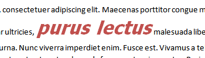

---

api_name:
- Microsoft.Office.DocumentFormat.OpenXML.Packaging
api_type:
- schema
ms.assetid: c38f2c94-f0b5-4bb5-8c95-02e556d4e9f1
title: 'Create and add a character style to a word processing document'
description: 'Learn how to create and add a character style to a word processing document using the Open XML SDK.'
ms.suite: office

ms.author: o365devx
author: o365devx
ms.topic: conceptual
ms.date: 05/13/2024
ms.localizationpriority: medium
---
# Create and add a character style to a word processing document

This topic shows how to use the classes in the Open XML SDK for
Office to programmatically create and add a character style to a word
processing document. It contains an example
`CreateAndAddCharacterStyle` method to illustrate this task, plus a
supplemental example method to add the styles part when it is necessary.


## CreateAndAddCharacterStyle Method

The `CreateAndAddCharacterStyle` sample method can be used to add a
style to a word processing document. You must first obtain a reference
to the style definitions part in the document to which you want to add
the style. See the [Calling the Sample Method](#calling-the-sample-method) section for an example that
shows how to do this.

The method accepts four parameters that indicate: the path to the file to edit,
the style id of the style (an internal identifier), the name of the style 
(for external use in the user interface), and optionally, any style aliases 
(alternate names for use in the user interface).

### [C#](#tab/cs-0)
[!code-csharp[](../../samples/word/create_and_add_a_character_style/cs/Program.cs#snippet1)]

### [Visual Basic](#tab/vb-0)
[!code-vb[](../../samples/word/create_and_add_a_character_style/vb/Program.vb#snippet1)]
***


The complete code listing for the method can be found in the [Sample Code](#sample-code) section.

## About Style IDs, Style Names, and Aliases

The style ID is used by the document to refer to the style, and can be
thought of as its primary identifier. Typically, you use the style ID to
identify a style in code. A style can also have a separate display name
shown in the user interface. Often, the style name, therefore, appears
in proper case and with spacing (for example, Heading 1), while the
style ID is more succinct (for example, heading1) and intended for
internal use. Aliases specify alternate style names that can be used in
an application's user interface.

For example, consider the following XML code example taken from a style
definition.

```xml
    <w:style w:type="character" w:styleId="OverdueAmountChar" . . .
      <w:aliases w:val="Late Due, Late Amount" />
      <w:name w:val="Overdue Amount Char" />
    . . .
    </w:style>
```

The style element `styleId` attribute defines the main internal identifier
of the style, the style ID (OverdueAmountChar). The aliases element
specifies two alternate style names, Late Due, and Late Amount, which
are comma separated. Each name must be separated by one or more commas.
Finally, the name element specifies the primary style name, which is the
one typically shown in an application's user interface.

## Calling the Sample Method

You can use the `CreateAndAddCharacterStyle`
example method to create and add a named style to a word processing
document using the Open XML SDK. The following code example shows how to
open and obtain a reference to a word processing document, retrieve a
reference to the document's style definitions part, and then call the
`CreateAndAddCharacterStyle` method.

To call the method, you pass a reference to the file to edit
as the first parameter, the style ID of the style as the second
parameter, the name of the style as the third parameter, and optionally,
any style aliases as the fourth parameter. For example, the following
code example creates the "Overdue Amount Char" character style in a
sample file that's name comes from the first argument to the method. It also
creates three runs of text in a paragraph, and applies the style to the
second run.

### [C#](#tab/cs-1)
[!code-csharp[](../../samples/word/create_and_add_a_character_style/cs/Program.cs#snippet2)]

### [Visual Basic](#tab/vb-1)
[!code-vb[](../../samples/word/create_and_add_a_character_style/vb/Program.vb#snippet2)]
***


## Style Types

WordprocessingML supports six style types, four of which you can specify
using the type attribute on the style element. The following
information, from section 17.7.4.17 in the [!include[ISO/IEC 29500 URL](../includes/iso-iec-29500-link.md)] specification,
introduces style types.

*Style types* refers to the property on a style which defines the type
of style created with this style definition. WordprocessingML supports
six types of style definitions by the values for the style definition's
type attribute:

- Paragraph styles
- Character styles
- Linked styles (paragraph + character) Accomplished via the link element (§17.7.4.6).
- Table styles
- Numbering styles
- Default paragraph + character properties

Consider a style called Heading 1 in a document as shown in the following code example.

```xml
    <w:style w:type="paragraph" w:styleId="Heading1">
      <w:name w:val="heading 1"/>
      <w:basedOn w:val="Normal"/>
      <w:next w:val="Normal"/>
      <w:link w:val="Heading1Char"/>
      <w:uiPriority w:val="1"/>
      <w:qformat/>
      <w:rsid w:val="00F303CE"/>
      …
    </w:style>
```

The type attribute has a value of paragraph, which indicates that the following style definition is a paragraph style.

You can set the paragraph, character, table and numbering styles types by specifying the corresponding value in the style element's type attribute.

## Character Style Type

You specify character as the style type by setting the value of the type attribute on the style element to "character".

The following information from section 17.7.9 of the ISO/IEC 29500 specification discusses character styles. Be aware that section numbers preceded by § indicate sections in the ISO specification.

### 17.7.9 Run (Character) Styles

*Character styles* are styles which apply to the contents of one or more
runs of text within a document's contents. This definition implies that
the style can only define character properties (properties which apply
to text within a paragraph) because it cannot be applied to paragraphs.
Character styles can only be referenced by runs within a document, and
they shall be referenced by the `rStyle` element within a run's run
properties element.

A character style has two defining style type-specific characteristics:

- The type attribute on the style has a value of character, which indicates that the following style definition is a character style.

- The style specifies only character-level properties using the `rPr` element. In this case, the run properties are the set of properties applied to each run which is of this style.

The character style is then applied to runs by referencing the `styleId`
attribute value for this style in the run properties' `rStyle` element.

The following image shows some text that has had a character style
applied. A character style can only be applied to a sub-paragraph level
range of text.

Figure 1. Text with a character style applied



## How the Code Works

The `CreateAndAddCharacterStyle` method
begins by opening the specified file and retrieving a reference to the styles element in the styles
part. The styles element is the root element of the part and contains
all of the individual style elements. If the reference is null, the
styles element is created and saved to the part.

### [C#](#tab/cs-2)
[!code-csharp[](../../samples/word/create_and_add_a_character_style/cs/Program.cs#snippet3)]

### [Visual Basic](#tab/vb-2)
[!code-vb[](../../samples/word/create_and_add_a_character_style/vb/Program.vb#snippet3)]
***


## Creating the Style

To create the style, the code instantiates the <xref:DocumentFormat.OpenXml.Wordprocessing.Style> class and sets certain properties,
such as the <xref:DocumentFormat.OpenXml.Wordprocessing.Style.Type> of style (paragraph), the <xref:DocumentFormat.OpenXml.Wordprocessing.StyleId>, and whether the style is a <xref:DocumentFormat.OpenXml.Wordprocessing.Style.CustomStyle>.

### [C#](#tab/cs-3)
[!code-csharp[](../../samples/word/create_and_add_a_character_style/cs/Program.cs#snippet4)]
### [Visual Basic](#tab/vb-3)
[!code-vb[](../../samples/word/create_and_add_a_character_style/vb/Program.vb#snippet4)]
***


The code results in the following XML.

```xml
    <w:style w:type="character" w:styleId="OverdueAmountChar" w:customStyle="true" xmlns:w="http://schemas.openxmlformats.org/wordprocessingml/2006/main">
    </w:style>
```

The code next creates the child elements of the style, which define the
properties of the style. To create an element, you instantiate its
corresponding class, and then call the <xref:DocumentFormat.OpenXml.OpenXmlElement.Append%2A> method to add the child element
to the style. For more information about these properties, see section
17.7 of the [!include[ISO/IEC 29500 URL](../includes/iso-iec-29500-link.md)] specification.

### [C#](#tab/cs-4)
[!code-csharp[](../../samples/word/create_and_add_a_character_style/cs/Program.cs#snippet5)]
### [Visual Basic](#tab/vb-4)
[!code-vb[](../../samples/word/create_and_add_a_character_style/vb/Program.vb#snippet5)]
***


Next, the code instantiates a <xref:DocumentFormat.OpenXml.Wordprocessing.StyleRunProperties> 
object to create a `rPr` (Run Properties) element. You specify the
character properties that apply to the style, such as font and color, in
this element. The properties are then appended as children of the `rPr` element.

When the run properties are created, the code appends the `rPr` element to the style, and the style element
to the styles root element in the styles part.

### [C#](#tab/cs-5)
[!code-csharp[](../../samples/word/create_and_add_a_character_style/cs/Program.cs#snippet6)]
### [Visual Basic](#tab/vb-5)
[!code-vb[](../../samples/word/create_and_add_a_character_style/vb/Program.vb#snippet6)]
***


The following XML shows the final style generated by the code shown here.

```xml
    <w:style w:type="character" w:styleId="OverdueAmountChar" w:customStyle="true" xmlns:w="http://schemas.openxmlformats.org/wordprocessingml/2006/main">
      <w:aliases w:val="Late Due, Late Amount" />
      <w:name w:val="Overdue Amount Char" />
      <w:link w:val="OverdueAmountPara" />
      <w:rPr>
        <w:rFonts w:ascii="Tahoma" />
        <w:sz w:val="48" />
        <w:color w:themeColor="accent2" />
        <w:b />
        <w:i />
      </w:rPr>
    </w:style>
```

## Applying the Character Style

Once you have the style created, you can apply it to a run by
referencing the `styleId` attribute value for this style in the run
properties' `rStyle` element. The following
code example shows how to apply a style to a run referenced by the
variable r. The style ID of the style to apply, OverdueAmountChar in
this example, is stored in the RunStyle property of the `rPr` object. This property represents the run
properties' `rStyle` element.

### [C#](#tab/cs-6)
[!code-csharp[](../../samples/word/create_and_add_a_character_style/cs/Program.cs#snippet7)]
### [Visual Basic](#tab/vb-6)
[!code-vb[](../../samples/word/create_and_add_a_character_style/vb/Program.vb#snippet7)]
***


## Sample Code

The following is the complete `CreateAndAddCharacterStyle` code sample in both C\# and Visual Basic.

### [C#](#tab/cs)
[!code-csharp[](../../samples/word/create_and_add_a_character_style/cs/Program.cs#snippet0)]

### [Visual Basic](#tab/vb)
[!code-vb[](../../samples/word/create_and_add_a_character_style/vb/Program.vb#snippet0)]
***

## See also

[How to: Apply a style to a paragraph in a word processing document](how-to-apply-a-style-to-a-paragraph-in-a-word-processing-document.md)

[Open XML SDK class library reference](/office/open-xml/open-xml-sdk)
