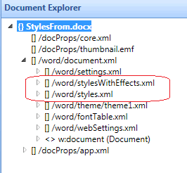

---

api_name:
- Microsoft.Office.DocumentFormat.OpenXML.Packaging
api_type:
- schema
ms.assetid: 67edb37c-cfec-461c-b616-5a8b7d074c91
title: 'How to: Replace the styles parts in a word processing document'
description: 'Learn how to replace the styles parts in a word processing document using the Open XML SDK.'
ms.suite: office

ms.author: o365devx
author: o365devx
ms.topic: conceptual
ms.date: 02/01/2024
ms.localizationpriority: medium
---
# Replace the styles parts in a word processing document

This topic shows how to use the classes in the Open XML SDK for
Office to programmatically replace the styles in a word processing
document with the styles from another word processing document. It
contains an example `ReplaceStyles` method to illustrate this task, as
well as the `ReplaceStylesPart` and `ExtractStylesPart` supporting
methods.

---------------------------------------------------------------------------------

## About Styles Storage

A word processing document package, such as a file that has a .docx
extension, is in fact a .zip file that consists of several parts. You
can think of each part as being similar to an external file. A part has
a particular content type, and can contain content equal to the content
of an external XML file, binary file, image file, and so on, depending
on the type. The standard that defines how Open XML documents are stored
in .zip files is called the Open Packaging Conventions. For more
information about the Open Packaging Conventions, see [!include[ISO/IEC 29500 URL](../includes/iso-iec-29500-2-link.md)].

Styles are stored in dedicated parts within a word processing document
package. A Microsoft Word 2010 document contains a single styles part.
later versions of Microsoft Word add a second stylesWithEffects part. The following
image from the Document Explorer in the Open XML SDK Productivity
Tool for Microsoft Office shows the document parts in a sample Word 2013+
document that contains styles.

Figure 1. Styles parts in a word processing document

In order to provide for "round-tripping" a document from Word 2013+ to
Word 2010 and back, Word 2013+ maintains both the original styles part
and the new styles part. (The Office Open XML File Formats specification
requires that Microsoft Word ignore any parts that it does not
recognize; Word 2010 does not notice the stylesWithEffects part that
Word 2013+ adds to the document.)

The code example provided in this topic can be used to replace these
styles parts.

---------------------------------------------------------------------------------

## ReplaceStyles Method

You can use the `ReplaceStyles` sample method to replace the styles in
a word processing document with the styles in another word processing
document. The `ReplaceStyles` method accepts two parameters: the first
parameter contains a string that indicates the path of the file that
contains the styles to extract. The second parameter contains a string
that indicates the path of the file to which to copy the styles,
effectively completely replacing the styles.

### [C#](#tab/cs-0)
[!code-csharp]

### [Visual Basic](#tab/vb-0)
[!code-vb]
***

The complete code listing for the `ReplaceStyles` method and its supporting methods
can be found in the [Sample Code](#sample-code) section.

---------------------------------------------------------------------------------

## Calling the Sample Method

To call the sample method, you pass a string for the first parameter
that indicates the path of the file with the styles to extract, and a
string for the second parameter that represents the path to the file in
which to replace the styles. The following sample code shows an example.
When the code finishes executing, the styles in the target document will
have been replaced, and consequently the appearance of the text in the
document will reflect the new styles.

### [C#](#tab/cs-1)
[!code-csharp]
### [Visual Basic](#tab/vb-1)
[!code-vb]
***

---------------------------------------------------------------------------------

## How the Code Works

The code extracts and replaces the styles part first, and then the
stylesWithEffects part second, and relies on two supporting methods to
do most of the work. The `ExtractStylesPart`
method has the job of extracting the content of the styles or
stylesWithEffects part, and placing it in an <xref:System.Xml.Linq.XDocument>
object. The `ReplaceStylesPart` method takes
the object created by `ExtractStylesPart` and
uses its content to replace the styles or stylesWithEffects part in the
target document.

### [C#](#tab/cs-2)
[!code-csharp]
### [Visual Basic](#tab/vb-2)
[!code-vb]
***

The final parameter in the signature for either the `ExtractStylesPart` or the `ReplaceStylesPart` method determines whether the
styles part or the stylesWithEffects part is employed. A value of false
indicates that you want to extract and replace the styles part. The
absence of a value (the parameter is optional), or a value of true (the
default), means that you want to extract and replace the
stylesWithEffects part.

### [C#](#tab/cs-3)
[!code-csharp]
### [Visual Basic](#tab/vb-3)
[!code-vb]
***

For more information about the `ExtractStylesPart` method, see [the associated sample](how-to-extract-styles-from-a-word-processing-document.md). The
following section explains the `ReplaceStylesPart` method.

---------------------------------------------------------------------------------

## ReplaceStylesPart Method

The `ReplaceStylesPart` method can be used to
replace the styles or styleWithEffects part in a document, given an
`XDocument` instance that contains the same
part for a Word 2010 or Word 2013+ document (as shown in the sample code
earlier in this topic, the `ExtractStylesPart` method can be used to obtain
that instance). The `ReplaceStylesPart`
method accepts three parameters: the first parameter contains a string
that indicates the path to the file that you want to modify. The second
parameter contains an `XDocument` object that
contains the styles or stylesWithEffect part from another word
processing document, and the third indicates whether you want to replace
the styles part, or the stylesWithEffects part (as shown in the sample
code earlier in this topic, you will need to call this procedure twice
for Word 2013+ documents, replacing each part with the corresponding part
from a source document).

### [C#](#tab/cs-4)
[!code-csharp]
### [Visual Basic](#tab/vb-4)
[!code-vb]
***

---------------------------------------------------------------------------------

## How the ReplaceStylesPart Code Works

The `ReplaceStylesPart` method examines the
document you specify, looking for the styles or stylesWithEffects part.
If the requested part exists, the method saves the supplied `XDocument` into the selected part.

The code starts by opening the document by using the <xref:DocumentFormat.OpenXml.Packaging.WordprocessingDocument.Open%2A> method and indicating that the
document should be open for read/write access (the final `true` parameter). Given the open document, the code
uses the <xref:DocumentFormat.OpenXml.Packaging.WordprocessingDocument.MainDocumentPart> property to navigate to
the main document part, and then prepares a variable named `stylesPart` to hold a reference to the styles part.

### [C#](#tab/cs-5)
[!code-csharp]
### [Visual Basic](#tab/vb-5)
[!code-vb]
***

---------------------------------------------------------------------------------

## Find the Correct Styles Part

The code next retrieves a reference to the requested styles part, using
the `setStylesWithEffectsPart` Boolean
parameter. Based on this value, the code retrieves a reference to the
requested styles part, and stores it in the `stylesPart` variable.

### [C#](#tab/cs-6)
[!code-csharp]
### [Visual Basic](#tab/vb-6)
[!code-vb]
***

---------------------------------------------------------------------------------

## Save the Part Contents

Assuming that the requested part exists, the code must save the entire
contents of the `XDocument` passed to the
method to the part. Each part provides a <xref:DocumentFormat.OpenXml.Packaging.OpenXmlPart.GetStream> method, which returns a <xref:System.IO.Stream>.
The code passes the Stream instance to the constructor of the <xref:System.IO.StreamWriter.%23ctor(System.IO.Stream)>
class, creating a stream writer around the stream of the part. Finally,
the code calls the <xref:System.Xml.Linq.XDocument.Save(System.IO.Stream)> method of
the XDocument, saving its contents into the styles part.

### [C#](#tab/cs-7)
[!code-csharp]
### [Visual Basic](#tab/vb-7)
[!code-vb]
***

---------------------------------------------------------------------------------

## Sample Code

The following is the complete `ReplaceStyles`, `ReplaceStylesPart`, and `ExtractStylesPart` methods in C\# and Visual
Basic.

### [C#](#tab/cs)
[!code-csharp]

### [Visual Basic](#tab/vb)
[!code-vb]

---------------------------------------------------------------------------------

## See also

- [Open XML SDK class library reference](/office/open-xml/open-xml-sdk)
