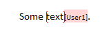

---

api_name:
- Microsoft.Office.DocumentFormat.OpenXML.Packaging
api_type:
- schema
ms.assetid: 70839c86-36ef-4b67-a682-abd5114b2bfe
title: 'How to: Retrieve comments from a word processing document'
ms.suite: office

ms.author: o365devx
author: o365devx
ms.topic: conceptual
ms.date: 01/26/2024
ms.localizationpriority: medium
---
# Retrieve comments from a word processing document

This topic describes how to use the classes in the Open XML SDK for
Office to programmatically retrieve the comments from the main document
part in a word processing document.


--------------------------------------------------------------------------------
## Open the Existing Document for Read-only Access
To open an existing document, instantiate the <xref:DocumentFormat.OpenXml.Packaging.WordprocessingDocument> class as shown in
the following `using` statement. In the same
statement, open the word processing file at the specified `fileName` by using the <xref:DocumentFormat.OpenXml.Packaging.WordprocessingDocument.Open(System.String,System.Boolean,DocumentFormat.OpenXml.Packaging.OpenSettings)> method. To open the file for editing the Boolean parameter is set to `true`. In this example you just need to read the file; therefore, you can open the file for read-only access by setting
the Boolean parameter to `false`.

### [C#](#tab/cs-0)
[!code-csharp[](../../samples/word/retrieve_comments/cs/Program.cs#snippet1)]
### [Visual Basic](#tab/vb-0)
[!code-vb[](../../samples/word/retrieve_comments/vb/Program.vb#snippet1)]
***

The `using` statement provides a recommended alternative to the .Open, .Save, .Close sequence. It ensures
that the `Dispose` method (internal method used by the Open XML SDK to clean up resources) is automatically called
when the closing brace is reached. The block that follows the `using` statement establishes a scope for the
object that is created or named in the `using` statement, in this case `wordDoc`.


--------------------------------------------------------------------------------
## Comments Element

The `comments` and `comment` elements are crucial to working with
comments in a word processing file. It is important in this code example
to familiarize yourself with those elements.

The following information from the [!include[ISO/IEC 29500 URL](../includes/iso-iec-29500-link.md)] specification
introduces the comments element.

> **comments (Comments Collection)**
> 
> This element specifies all of the comments defined in the current
> document. It is the root element of the comments part of a
> WordprocessingML document.
> 
> Consider the following WordprocessingML fragment for the content of a
> comments part in a WordprocessingML document:

```xml
    <w:comments>
      <w:comment … >
        …
      </w:comment>
    </w:comments>
```

> © [!include[ISO/IEC 29500 version](../includes/iso-iec-29500-version.md)]

The following XML schema segment defines the contents of the comments
element.

```xml
    <complexType name="CT_Comments">
       <sequence>
           <element name="comment" type="CT_Comment" minOccurs="0" maxOccurs="unbounded"/>
       </sequence>
    </complexType>
```

---------------------------------------------------------------------------------
## Comment Element

The following information from the [!include[ISO/IEC 29500 URL](../includes/iso-iec-29500-link.md)] specification
introduces the comment element.

> **comment (Comment Content)**
> 
> This element specifies the content of a single comment stored in the
> comments part of a WordprocessingML document.
> 
> If a comment is not referenced by document content via a matching
> **id** attribute on a valid use of the **commentReference** element,
> then it may be ignored when loading the document. If more than one
> comment shares the same value for the **id** attribute, then only one
> comment shall be loaded and the others may be ignored.
> 
> Consider a document with text with an annotated comment as follows:



> This comment is represented by the following WordprocessingML
> fragment.

```xml
    <w:comment w:id="1" w:initials="User">
      …
    </w:comment>
```
> The **comment** element specifies the presence of a single comment
> within the comments part.
> 
> © [!include[ISO/IEC 29500 version](../includes/iso-iec-29500-version.md)]

  
The following XML schema segment defines the contents of the comment element.

```xml
    <complexType name="CT_Comment">
       <complexContent>
           <extension base="CT_TrackChange">
              <sequence>
                  <group ref="EG_BlockLevelElts" minOccurs="0" maxOccurs="unbounded"/>
              </sequence>
              <attribute name="initials" type="ST_String" use="optional"/>
           </extension>
       </complexContent>
    </complexType>
```

--------------------------------------------------------------------------------
## How the Sample Code Works
After you have opened the file for read-only access, you instantiate the <xref:DocumentFormat.OpenXml.Packaging.WordprocessingCommentsPart> class. You can
then display the inner text of the <xref:DocumentFormat.OpenXml.Wordprocessing.Comment> element.

### [C#](#tab/cs-1)
[!code-csharp[](../../samples/word/retrieve_comments/cs/Program.cs#snippet2)]
### [Visual Basic](#tab/vb-1)
[!code-vb[](../../samples/word/retrieve_comments/vb/Program.vb#snippet2)]
***

--------------------------------------------------------------------------------
## Sample Code

The following is the complete sample code in both C\# and Visual Basic.

### [C#](#tab/cs)
[!code-csharp[](../../samples/word/retrieve_comments/cs/Program.cs#snippet0)]

### [Visual Basic](#tab/vb)
[!code-vb[](../../samples/word/retrieve_comments/vb/Program.vb#snippet0)]

--------------------------------------------------------------------------------
## See also


- [Open XML SDK class library reference](/office/open-xml/open-xml-sdk)
