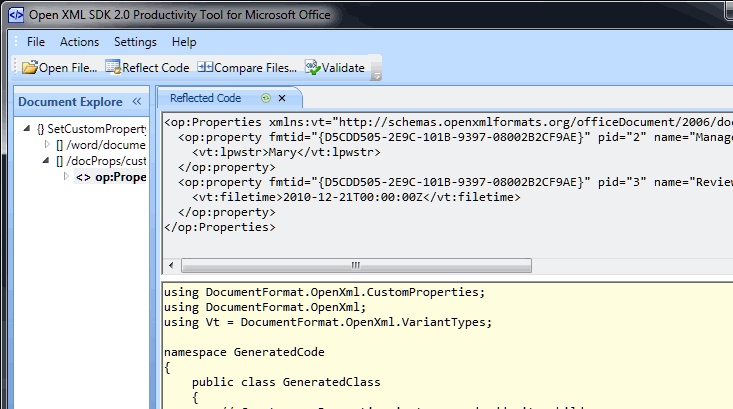
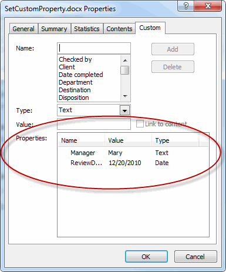

---

api_name:
- Microsoft.Office.DocumentFormat.OpenXML.Packaging
api_type:
- schema
ms.assetid: how-to-set-a-custom-property-in-a-word-processing-document
title: 'How to: Set a custom property in a word processing document'
description: 'Learn how to use the classes in the Open XML SDK for Office to programmatically set a custom property in a word processing document.'
ms.suite: office

ms.author: o365devx
author: o365devx
ms.topic: conceptual
ms.date: 01/26/2024
ms.localizationpriority: high
---
# Set a custom property in a word processing document

This topic shows how to use the classes in the Open XML SDK for Office to programmatically set a custom property in a word processing document. It contains an example  `SetCustomProperty` method to illustrate this task.

The sample code also includes an enumeration that defines the possible types of custom properties. The `SetCustomProperty` method requires that you supply one of these values when you call the method.

### [C#](#tab/cs-0)
[!code-csharp[](../../samples/word/set_a_custom_property/cs/Program.cs#snippet1)]
### [Visual Basic](#tab/vb-0)
[!code-vb[](../../samples/word/set_a_custom_property/vb/Program.vb#snippet1)]
***


## How Custom Properties Are Stored

It is important to understand how custom properties are stored in a word
processing document. You can use the Productivity Tool for Microsoft
Office, shown in Figure 1, to discover how they are stored. This tool
enables you to open a document and view its parts and the hierarchy of
parts. Figure 1 shows a test document after you run the code in the
[Calling the SetCustomProperty Method](#calling-the-setcustomproperty-method) section of
this article. The tool displays in the right-hand panes both the XML for
the part and the reflected C\# code that you can use to generate the
contents of the part.

Figure 1. Open XML SDK Productivity Tool for Microsoft Office

 
  
The relevant XML is also extracted and shown here for ease of reading.

```xml
    <op:Properties xmlns:vt="https://schemas.openxmlformats.org/officeDocument/2006/docPropsVTypes" xmlns:op="https://schemas.openxmlformats.org/officeDocument/2006/custom-properties">
      <op:property fmtid="{D5CDD505-2E9C-101B-9397-08002B2CF9AE}" pid="2" name="Manager">
        <vt:lpwstr>Mary</vt:lpwstr>
      </op:property>
      <op:property fmtid="{D5CDD505-2E9C-101B-9397-08002B2CF9AE}" pid="3" name="ReviewDate">
        <vt:filetime>2010-12-21T00:00:00Z</vt:filetime>
      </op:property>
    </op:Properties>
```

If you examine the XML content, you will find the following:

- Each property in the XML content consists of an XML element that includes the name and the value of the property.
- For each property, the XML content includes an **fmtid** attribute, which is always set to the same string value: `{D5CDD505-2E9C-101B-9397-08002B2CF9AE}`.
- Each property in the XML content includes a **pid** attribute, which must include an integer starting at 2 for the first property and incrementing for each successive property.
- Each property tracks its type (in the figure, the **vt:lpwstr** and **vt:filetime** element names define the types for each property).

The sample method that is provided here includes the code that is required to create or modify a custom document property in a Microsoft Word document. You can find the complete code listing for the method in the [Sample Code](#sample-code) section.

## SetCustomProperty Method

Use the `SetCustomProperty` method to set a custom property in a word processing document. The `SetCustomProperty` method accepts four parameters:

- The name of the document to modify (string).

- The name of the property to add or modify (string).

- The value of the property (object).

- The kind of property (one of the values in the **PropertyTypes** enumeration).

### [C#](#tab/cs-1)
[!code-csharp[](../../samples/word/set_a_custom_property/cs/Program.cs#snippet2)]
### [Visual Basic](#tab/vb-1)
[!code-vb[](../../samples/word/set_a_custom_property/vb/Program.vb#snippet2)]
***


## Calling the SetCustomProperty Method

The `SetCustomProperty` method enables you to set a custom property, and returns the current value of the property, if it exists. To call the sample method, pass the file name, property name, property value, and property type parameters. The following sample code shows an example.

### [C#](#tab/cs-2)
[!code-csharp[](../../samples/word/set_a_custom_property/cs/Program.cs#snippet3)]
### [Visual Basic](#tab/vb-2)
[!code-vb[](../../samples/word/set_a_custom_property/vb/Program.vb#snippet3)]
***


After running this code, use the following procedure to view the custom properties from Word.

1. Open the .docx file in Word.
2. On the **File** tab, click **Info**.
3. Click **Properties**.
4. Click **Advanced Properties**.

The custom properties will display in the dialog box that appears, as shown in Figure 2.

Figure 2. Custom Properties in the Advanced Properties dialog box

 

## How the Code Works

The `SetCustomProperty` method starts by setting up some internal variables. Next, it examines the information about the property, and creates a new <xref:DocumentFormat.OpenXml.CustomProperties.CustomDocumentProperty> based on the parameters that you have specified. The code also maintains a variable named `propSet` to indicate whether it successfully created the new property object. This code verifies the
type of the property value, and then converts the input to the correct type, setting the appropriate property of the <xref:DocumentFormat.OpenXml.CustomProperties.CustomDocumentProperty> object.

> [!NOTE]
> The <xref:DocumentFormat.OpenXml.CustomProperties.CustomDocumentProperty> type works much like a VBA Variant type. It maintains separate placeholders as properties for the various types of data it might contain.

### [C#](#tab/cs-3)
[!code-csharp[](../../samples/word/set_a_custom_property/cs/Program.cs#snippet4)]
### [Visual Basic](#tab/vb-3)
[!code-vb[](../../samples/word/set_a_custom_property/vb/Program.vb#snippet4)]
***

At this point, if the code has not thrown an exception, you can assume that the property is valid, and the code sets the <xref:DocumentFormat.OpenXml.CustomProperties.CustomDocumentProperty.FormatId> and <xref:DocumentFormat.OpenXml.CustomProperties.CustomDocumentProperty.Name> properties of the new custom property.

### [C#](#tab/cs-4)
[!code-csharp[](../../samples/word/set_a_custom_property/cs/Program.cs#snippet5)]
### [Visual Basic](#tab/vb-4)
[!code-vb[](../../samples/word/set_a_custom_property/vb/Program.vb#snippet5)]
***


## Working with the Document

Given the <xref:DocumentFormat.OpenXml.CustomProperties.CustomDocumentProperty> object, the code next interacts with the document that you supplied in the parameters to the `SetCustomProperty` procedure. The code starts by opening the document in read/write mode by
using the <xref:DocumentFormat.OpenXml.Packaging.WordprocessingDocument.Open%2A> method of the <xref:DocumentFormat.OpenXml.Packaging.WordprocessingDocument> class. The code attempts to retrieve a reference to the custom file properties part by using the <xref:DocumentFormat.OpenXml.Packaging.WordprocessingDocument.CustomFilePropertiesPart> property of the document.

### [C#](#tab/cs-5)
[!code-csharp[](../../samples/word/set_a_custom_property/cs/Program.cs#snippet6)]
### [Visual Basic](#tab/vb-5)
[!code-vb[](../../samples/word/set_a_custom_property/vb/Program.vb#snippet6)]
***


If the code cannot find a custom properties part, it creates a new part, and adds a new set of properties to the part.

### [C#](#tab/cs-6)
[!code-csharp[](../../samples/word/set_a_custom_property/cs/Program.cs#snippet7)]
### [Visual Basic](#tab/vb-6)
[!code-vb[](../../samples/word/set_a_custom_property/vb/Program.vb#snippet7)]
***


Next, the code retrieves a reference to the <xref:DocumentFormat.OpenXml.Packaging.CustomFilePropertiesPart.Properties> property of the custom
properties part (that is, a reference to the properties themselves). If
the code had to create a new custom properties part, you know that this
reference is not null. However, for existing custom properties parts, it
is possible, although highly unlikely, that the <xref:DocumentFormat.OpenXml.Packaging.CustomFilePropertiesPart.Properties> property will be null. If so, the code
cannot continue.

### [C#](#tab/cs-7)
[!code-csharp[](../../samples/word/set_a_custom_property/cs/Program.cs#snippet8)]
### [Visual Basic](#tab/vb-7)
[!code-vb[](../../samples/word/set_a_custom_property/vb/Program.vb#snippet8)]
***


If the property already exists, the code retrieves its current value,
and then deletes the property. Why delete the property? If the new type
for the property matches the existing type for the property, the code
could set the value of the property to the new value. On the other hand,
if the new type does not match, the code must create a new element,
deleting the old one (it is the name of the element that defines its
type—for more information, see Figure 1). It is simpler to always delete
and then re-create the element. The code uses a simple LINQ query to
find the first match for the property name.

### [C#](#tab/cs-8)
[!code-csharp[](../../samples/word/set_a_custom_property/cs/Program.cs#snippet9)]
### [Visual Basic](#tab/vb-8)
[!code-vb[](../../samples/word/set_a_custom_property/vb/Program.vb#snippet9)]
***


Now, you will know for sure that the custom property part exists, a property that has the same name as the new property does not exist, and that there may be other existing custom properties. The code performs the following steps:

1. Appends the new property as a child of the properties collection.

2. Loops through all the existing properties, and sets the <span class="keyword">**pid**</span> attribute to increasing values, starting at 2.

3. Saves the part.

### [C#](#tab/cs-9)
[!code-csharp[](../../samples/word/set_a_custom_property/cs/Program.cs#snippet10)]
### [Visual Basic](#tab/vb-9)
[!code-vb[](../../samples/word/set_a_custom_property/vb/Program.vb#snippet10)]
***


Finally, the code returns the stored original property value.

### [C#](#tab/cs-10)
[!code-csharp[](../../samples/word/set_a_custom_property/cs/Program.cs#snippet11)]
### [Visual Basic](#tab/vb-10)
[!code-vb[](../../samples/word/set_a_custom_property/vb/Program.vb#snippet11)]
***

## Sample Code

The following is the complete `SetCustomProperty` code sample in C\# and Visual Basic.

### [C#](#tab/cs)
[!code-csharp[](../../samples/word/set_a_custom_property/cs/Program.cs#snippet0)]

### [Visual Basic](#tab/vb)
[!code-vb[](../../samples/word/set_a_custom_property/vb/Program.vb#snippet0)]
***

## See also

- [Open XML SDK class library reference](/office/open-xml/open-xml-sdk)
